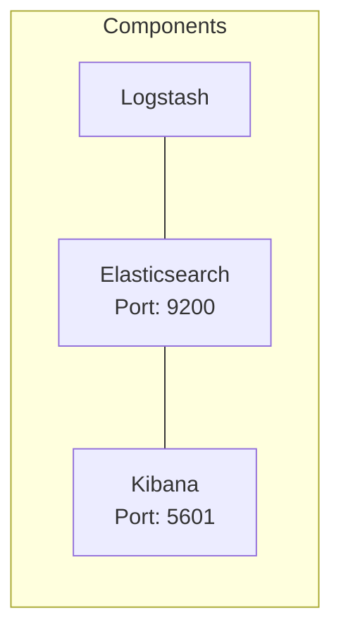

# AuditOps

AuditOps is a lightweight solution for operational auditing and log management, with Logstash as its core component.

## Deployment Diagram
A pre-configured Docker Compose setup deploying three tools: Logstash, alongside Elasticsearch and Kibana for testing purposes, is provided.

* Elasticsearch: Centralized data storage and search (accessible at http://elasticsearch:9200).
* Logstash: Flexible pipeline for log processing and enrichment.
* Kibana: Intuitive dashboard for log analysis and visualization (available at http://localhost:5601).

## Setup

Steps to follow:
1. Run `docker compose up -d` or `docker compose up` (for debugging)
2. View kibana at http://localhost:5601
3. Ask elasticsearch at http://elasticsearch:9200
4. Perform auth actions e.g. `sudo ls`

